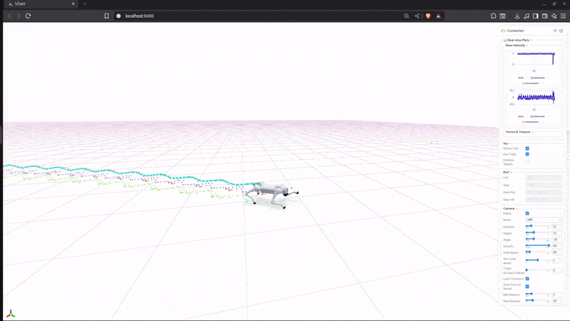

<h1 align="center"> APEX: Action Priors Enable Efficient Exploration for Robust Motion Tracking on Legged Robots
 </h1>

<div align="center">

[[Website]](https://marmotlab.github.io/APEX/)
<!-- [[Video]](https://www.youtube.com/watch?v=f6GKpPCyOGY) -->


[](https://developer.nvidia.com/isaac-gym) [](https://ubuntu.com/blog/tag/22-04-lts) []()


</div>

---
### Installation

Follow these steps to set up the [legged_gym](https://github.com/leggedrobotics/legged_gym) environment:

1. **Create a Python 3.8 virtual environment:**
   ```bash
   conda create --name=apex python=3.8
   conda activate apex
   ```

2. **Install PyTorch:** 
   - For CUDA 11:
     ```bash
     pip install torch==1.10.0+cu113 torchvision==0.11.1+cu113 torchaudio==0.10.0+cu113 -f https://download.pytorch.org/whl/cu113/torch_stable.html
     ```
   - For CUDA 12:
     ```bash
     pip install torch==2.2.2+cu121 torchvision torchaudio --index-url https://download.pytorch.org/whl/cu121
     ```

3. **Install Isaac Gym:**  
   Download and install Isaac Gym Preview 3 (Preview 2 will not work!) from [NVIDIA](https://developer.nvidia.com/isaac-gym).
   ```bash
   cd isaacgym/python
   pip install -e .
   ```

   Test the installation:
   ```bash
   cd examples
   python 1080_balls_of_solitude.py
   ```
   For troubleshooting, see `isaacgym/docs/index.html`.

4. **Clone this repository:**
   ```bash
   git clone https://github.com/marmotlab/APEX.git
   ```

5. **Install our version of rsl_rl (Multi-Critic PPO implementation) and APEX:**
   ```bash
   cd APEX/rsl_rl
   pip install -e .
   cd ..
   pip install -e .
   ```
---
### Training your own policies
**To train a policy:**

```bash
python legged_gym/scripts/train.py --task=go2_flat --headless
```
To change motions, action prior parameters, or switch between single and multi-motion training, edit the config file at [`legged_gym/envs/param_config.yaml`](legged_gym/envs/param_config.yaml).

Common changes include:
- Changing imitation data path: `path_to_imitation_data`
- Training multiple/single skills: `train_multi_skills`
- Multi-critic/ Single critic: `use_one_critic_ablation`


### Visualize the trained examples
The trained policies are in the logs folder. To run with (cool looking) viser visualization:

```console
python legged_gym/scripts/play_viser.py --task=go2_flat --load_run=<run_name>
```
<div align="center">

</div>

To run without viser visualization:

```console
python legged_gym/scripts/play.py --task=go2_flat --load_run=<run_name>
```
Note: Change control_type to position for evaluation 
## Upcoming
- [x] Release training code
- [ ] Release sim2sim code
- [ ] Release sim2real code
- [ ] Release Isaac Lab version 
## Credit
If you find this work useful, please consider citing us and the following works:

+ APEX: Action Priors Enable Efficient Exploration for Skill Imitation on Articulated Robots

```bibtex
@misc{sood2025apexactionpriorsenable,
      title={APEX: Action Priors Enable Efficient Exploration for Robust Motion Tracking on Legged Robots}, 
      author={Shivam Sood and Laukik Nakhwa and Sun Ge and Yuhong Cao and Jin Cheng and Fatemah Zargarbashi and Taerim Yoon and Sungjoon Choi and Stelian Coros and Guillaume Sartoretti},
      year={2025},
      eprint={2505.10022},
      archivePrefix={arXiv},
      primaryClass={cs.RO},
      url={https://arxiv.org/abs/2505.10022}, 
}
```

+ DecAP: Decaying Action Priors for Accelerated Imitation Learning of Torque-Based Legged Locomotion Policies

```bibtex
@article{Sood2023DecAPD,
  title={DecAP : Decaying Action Priors for Accelerated Imitation Learning of Torque-Based Legged Locomotion Policies},
  author={Shivam Sood and Ge Sun and Peizhuo Li and Guillaume Sartoretti},
  journal={2024 IEEE/RSJ International Conference on Intelligent Robots and Systems (IROS)},
  year={2023},
  pages={2809-2815},
  url={https://api.semanticscholar.org/CorpusID:263830010}
}
```

We build on the codebase from [Legged Gym](https://github.com/leggedrobotics/legged_gym), [RSL RL](https://github.com/leggedrobotics/rsl_rl) and use [Viser](https://viser.studio/main/) for visualizations:
  + Rudin, Nikita, et al. "Learning to walk in minutes using massively parallel deep reinforcement learning." CoRL 2022.

```bibtex
@inproceedings{rudin2022learning,
  title={Learning to walk in minutes using massively parallel deep reinforcement learning},
  author={Rudin, Nikita and Hoeller, David and Reist, Philipp and Hutter, Marco},
  booktitle={Conference on robot learning},
  pages={91--100},
  year={2022},
  organization={PMLR}
}
```

  + Viser: Imperative, Web-based 3D Visualization in Python
```bibtex
@misc{yi2025viser,
      title={Viser: Imperative, Web-based 3D Visualization in Python},
      author={Brent Yi and Chung Min Kim and Justin Kerr and Gina Wu and Rebecca Feng and Anthony Zhang and Jonas Kulhanek and Hongsuk Choi and Yi Ma and Matthew Tancik and Angjoo Kanazawa},
      year={2025},
      eprint={2507.22885},
      archivePrefix={arXiv},
      primaryClass={cs.CV},
      url={https://arxiv.org/abs/2507.22885},
}
```